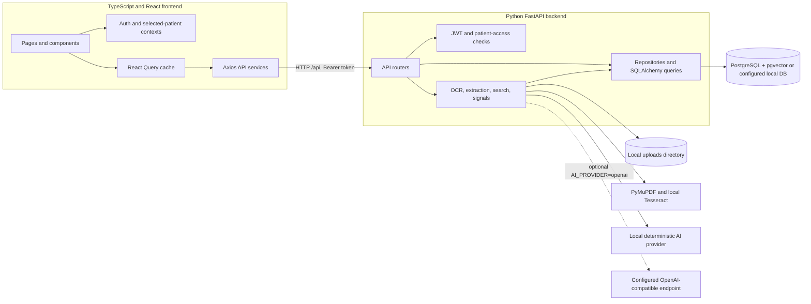
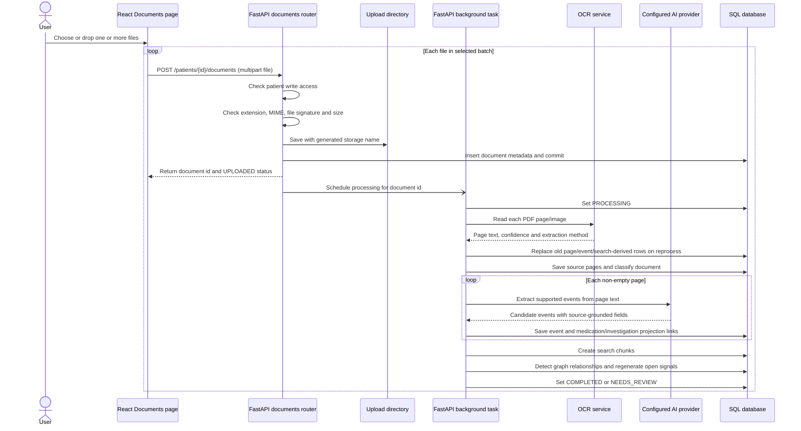
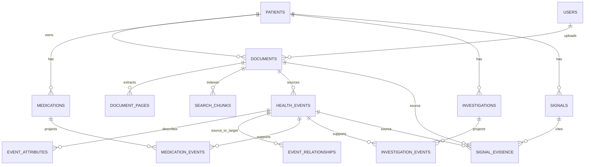

# MedGraph codebase guide

This guide describes the implementation currently in this repository. It is intended to help a developer follow a request from the TypeScript interface through FastAPI, processing services, and persisted data. The project is a research prototype: extracted text and rule-generated observations must be checked against their source pages.

## 1. System map



The frontend uses Vite in development and Axios with `/api` as its base URL. Vite proxies that prefix to FastAPI. The hosted Compose setup places Nginx in front of the frontend and API. FastAPI routers are mounted under `/api` in `backend/app/main.py`; they call authorization helpers, asynchronous SQLAlchemy sessions, and domain services.

## 2. Frontend: TypeScript and React

### Startup and routing

- `frontend/src/main.tsx` creates the React root, React Query `QueryClient`, browser router, and `AuthProvider`.
- `frontend/src/routes/index.tsx` declares public login/register routes and protected `/app/*` routes. `ProtectedRoute` requires a logged-in user and provides `PatientProvider`. `AdminRoute` restricts the research page to administrators.
- `frontend/src/layouts/AppLayout.tsx` renders the sidebar, session identity, and route outlet.
- Page components under `frontend/src/pages/` fetch and render one product surface each. Shared UI and provenance components are under `frontend/src/components/`.

### Authentication and patient selection

`useAuth` restores the JWT from browser `localStorage`, calls `/api/auth/me`, and exposes login/register/logout state. `frontend/src/services/api.ts` adds the bearer token to requests and sends the browser to `/login` after a 401. `usePatient` remembers the selected patient id in local storage and loads patient data through `patientsService`.

These are client convenience mechanisms. The API must still check the token, patient access, and write permissions for every protected operation; hiding a menu item is not authorization.

### Data fetching and uploads

React Query owns page caches and query state. A page query uses a stable key such as `['documents', patientId]`; upload/delete mutations invalidate those keys (and deletion invalidates all cached patient views so events and signals refresh too). Documents with active processing statuses are polled by the Documents page.

`FileUpload.tsx` accepts multiple files from the native picker or a multi-file drag/drop. `DocumentsPage.tsx` runs each selected file through the existing single-file API sequentially. The batch shows `Waiting`, `Uploading`, `Uploaded; processing queued`, or `Upload failed` for each file. One failed file does not cancel later uploads. The backend still enforces a per-file size limit.

`GraphPage.tsx` loads a patient’s events and their relationships, then maps each event to a React Flow node and each stored relationship to an edge. The graph layout uses a compact three-column grid and a canvas with an explicit minimum height so its nodes remain visible in constrained viewports.

## 3. Backend: FastAPI and Python

### Request path

- `backend/app/main.py` creates the FastAPI app, CORS configuration, exception handlers, startup upload directory, and `/api` routers.
- `backend/app/api/` contains HTTP parsing, response construction, dependency wiring, and status codes. For example, `documents.py` owns upload/list/detail/file/reprocess/delete endpoints.
- `backend/app/core/security.py` handles bcrypt password hashes and JWT creation/validation. `backend/app/core/access.py` checks patient ownership/access rows and write scope.
- `backend/app/db/session.py` yields an `AsyncSession`; `backend/app/db/models/` defines persisted entities; `backend/app/repositories/` contains reusable data access.
- `backend/app/services/` implements OCR, extraction, search, relationships, and signals. Provider selection is in `services/ai/factory.py`.

The default rule provider works on local OCR text and makes no network calls. Setting `AI_PROVIDER=openai` selects `OpenAIProvider`; that provider sends document text to the configured compatible endpoint. OCR defaults to local PyMuPDF/Tesseract handling.

## 4. Document-ingestion algorithm



### File validation and storage

`backend/app/api/documents.py` first checks patient write access, then validates extension, claimed MIME type, content signature, and byte length against `MAX_FILE_SIZE`. `backend/app/utils/file_utils.py` owns filename sanitization, generated storage names, and signature checks. The original file is stored beneath `UPLOAD_DIR/<patient UUID>/` with a generated filename; the original safe display name is database metadata.

### OCR decision logic

`backend/app/services/ocr_service.py` handles PDFs and raster images:

1. For PDFs, open with PyMuPDF and reject invalid, zero-page, over-page-limit, or oversized rendered pages.
2. Extract embedded text page by page. If a page has at least `OCR_MIN_TEXT_CHARS`, keep that text and mark its extraction method `pdf_text_layer`.
3. Otherwise render that page at `OCR_RENDER_DPI` and call Tesseract `image_to_data` with the configured language and page-segmentation mode 6.
4. Normalize Tesseract word confidence from a 0–100 scale to 0–1 and retain word boxes in the OCR result. Image uploads are EXIF-corrected and converted to RGB before OCR.
5. Persist page number, text, and confidence. Empty/unreadable output becomes `NEEDS_REVIEW`; missing OCR dependencies or processing exceptions become `FAILED` with a configuration-oriented message.

Native PDF text does not require Tesseract. Scanned pages/images do. OCR confidence is a transcription hint, not an accuracy guarantee.

### Classification and fact extraction

The factory chooses `LocalRuleAIProvider` for `local`/`rules` (and the compatibility alias `mock`), or `OpenAIProvider` only when explicitly configured. The old mock provider no longer generates canned content.

The local classifier uses ordered keyword/regular-expression checks over the first lines and complete text to label lab, prescription, discharge, radiology, consultation, or other documents. Local extraction:

1. Splits real OCR text into non-empty lines and finds an explicit date in the first 12 lines for a fallback date.
2. Applies English patterns for numeric lab values, allergies/NKDA, medication actions and dose, imaging/test mentions, follow-up, and consultation.
3. Attaches the original line as description/source excerpt. Values and units are stored separately where the pattern recognizes them. Unsupported text produces no fact rather than a canned fact.
4. Removes in-page duplicate candidates using event type, date, normalized entity, and title. `extraction_service.merge_duplicate_events` provides a second deduplication keyed by type, entity, date, value, and source excerpt/description.
5. Parses only explicit dates (`normalize_date` rejects relative phrases rather than inventing a date), normalizes medication names by removing dose units, and clamps confidence to 0–1.
6. Persists each fact with patient id, source document id, source page, excerpt, confidence, and supported value/unit fields. Medication and investigation events create linked patient-level projection rows.

`OpenAIProvider` uses a structured response schema for extraction and sends bounded text prefixes to the configured model. Its output passes through the same persistence service. Classification/extraction confidence values are heuristics supplied by the provider; they are not clinically calibrated.

## 5. Graph relationships, signals and search

### Relationships

`relationship_service.detect_relationships` loads one patient’s events and applies deterministic pairwise checks:

- A test recommendation is linked to a test completion/result when both have entity names, the result entity contains the recommendation entity (case-insensitive), and available dates do not put the recommendation after the result. Existing identical `RESULT_OF` links are not duplicated.
- A follow-up recommendation is linked to the first later follow-up completion or consultation with available dates. Existing `FOLLOW_UP_TO` links are not duplicated.
- Medication relationship detection is currently a placeholder (`pass`). It should not be described as implemented graph inference.

These are lexical/date heuristics; a relationship edge means the rule matched, not that a clinician established causality.

### Rule-generated signals

`signal_service.py` recomputes `OPEN` signals and their evidence for a patient before each run; non-open reviewed signals are retained. It currently checks:

- a medication marked stopped followed by a later start/continue event with a normalized matching name;
- an explicit “no known allergy” report combined with a specific allergy report;
- a follow-up recommendation without a later matching completion or stored follow-up relationship;
- monotonic numeric investigation values with at least three measurements and more than 10% first-to-last change.

Each emitted signal stores supporting/conflicting `SignalEvidence` references to source events, documents, pages, and excerpts. Confidence and severity are hard-coded rule scores/thresholds, and absence of a record is not proof that an event did not happen. Signal review status is separate from extraction.

### Search and Ask MedGraph

`search_service.chunk_document` splits each page’s text into 700-character chunks with 100-character overlap. Chunks are scoped to the source document and stored in `search_chunks`; the current implementation stores `embedding=None` and does not perform vector similarity. `search_patient_chunks` scopes the query to the authorized patient first, case-folds whitespace-separated query terms, scores chunks by summed substring occurrence counts, and returns the top five sorted by score then page/chunk order. The search API constructs citations from the selected source document and page. Related events are found by substring matching query terms against event title, description, entity, and source excerpt.

The API’s answer is therefore matching record text (or “no matching evidence”), not an independent clinical conclusion. The displayed citation confidence is a formula derived from hit counts, not a calibrated probability.

## 6. Document deletion and data lifecycle

The Documents table offers a per-document `Remove` action with a confirmation dialog. `DELETE /api/documents/{document_id}` requires authenticated patient write access. It stages the on-disk file by renaming it inside that patient’s upload folder, then deletes dependent rows in a single database transaction:

- document pages and search chunks;
- health events sourced by the document;
- event attributes and every relationship edge incident to those events;
- signal evidence that names the document or its events, affected signals, and feedback referencing the removed events/signals;
- medication/investigation event links, followed by projection rows with no remaining event links;
- document processing job rows and document metadata.

It then regenerates open signals from the remaining patient events and commits. If the database operation fails, the staged source file is moved back to its original name. After commit the staged file is unlinked; a rare filesystem unlink failure returns an explicit error explaining that an operator must clean the staged file. Patient upload directories are removed only when empty. This is a physical delete, not a trash/restore workflow. No deletion action is run automatically when adding this feature.

OCR text, search chunks, event excerpts, and affected generated signals are removed so the search index and patient views do not retain that source. Existing database backups, filesystem snapshots, server logs, or copies made outside MedGraph are not erased by this endpoint; retention/backup deletion is an operator responsibility.

Processing and deletion share an in-process per-document `asyncio.Lock`, preventing a background OCR task in the same API process from writing rows while deletion runs. FastAPI `BackgroundTasks` and this lock are not a distributed job system: multiple API workers/replicas need a database/distributed lock or durable job queue before relying on this guarantee.

## 7. Data model sketch



Foreign keys are declared in `backend/app/db/models/`. The current schema initialization creates missing tables but is not a migration system; use reviewed Alembic migrations for schema changes in an existing hosted database.

## 8. Important modules at a glance

| Area | Entry points | Main responsibility |
| --- | --- | --- |
| App bootstrap | `frontend/src/main.tsx`, `frontend/src/routes/index.tsx` | Providers, route tree, auth gates |
| HTTP client | `frontend/src/services/api.ts` | `/api` base URL, bearer header, 401 handling |
| Documents UI | `frontend/src/pages/DocumentsPage.tsx`, `frontend/src/components/FileUpload.tsx` | Multi-select, per-file batch state, document list and confirmed removal |
| Document API | `backend/app/api/documents.py` | Validation, CRUD endpoints, access checks, cleanup transaction |
| Processing pipeline | `backend/app/services/document_service.py` | OCR orchestration, persistence, job status and document lock |
| OCR | `backend/app/services/ocr_service.py` | PDF text layer, rasterization and Tesseract |
| Rules/providers | `backend/app/services/ai/` | Local classifier/extractor or explicit hosted provider |
| Event persistence | `backend/app/services/extraction_service.py` | Normalization, dedupe and medication/investigation projection writes |
| Graph rules | `backend/app/services/relationship_service.py` | Recommendation-result and follow-up edges |
| Signals | `backend/app/services/signal_service.py` | Deterministic rules, evidence, open-signal refresh |
| Search | `backend/app/services/search_service.py`, `backend/app/api/search.py` | Chunking, patient-scoped token counts and citations |
| Auth/access | `backend/app/core/security.py`, `backend/app/core/access.py` | JWT, password verification, patient-level read/write checks |

## 9. Development and verification

From the repository root, use `README.md` for host/Docker setup and OCR installation. Typical source checks are:

```powershell
cd frontend
npx tsc --noEmit -p tsconfig.json
npm run build

cd ..\backend
python -m compileall -q app
```

The unit suite is documented in `README.md`. For schema or deletion work, use a disposable database and disposable upload directory; do not verify destructive behavior against a database containing records you want to keep. The per-document remove endpoint must be invoked only after a user explicitly confirms the displayed filename.
