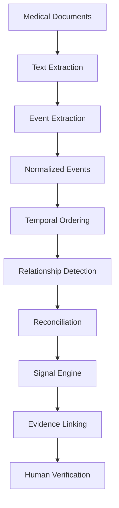

# MedGraph — AI-Based Healthcare Journey Reconstruction

> "Don't just store the medical record. Understand what happened next."

**Research prototype for reconstructing patient healthcare journeys from fragmented medical records.**

## Research Question

*"Can AI reconstruct a patient's healthcare journey from fragmented medical records and reliably identify important changes, conflicting information, and missing follow-up evidence?"*

## What MedGraph Does

MedGraph ingests fragmented medical records (e.g., consultation notes, lab results, prescriptions) and applies NLP techniques to extract structured healthcare events. It then reconstructs the patient's temporal healthcare journey and uses a rules-based and AI-assisted signal engine to detect discrepancies, missing follow-ups, and significant longitudinal trends.

## What MedGraph Is NOT

- It is NOT an Electronic Health Record (EHR) system.
- It is NOT a diagnostic tool.
- It is NOT a substitute for professional medical judgment.

## Core Pipeline



## Signal Types

| Signal | Description | Example |
|--------|-------------|--------|
| Medication Inconsistency | Identifies discrepancies in medication records over time. | Metformin discontinued then appears active. |
| Conflicting Information | Highlights contradictions within the patient's record. | Penicillin allergy vs "No known drug allergies". |
| Missing Follow-up Evidence | Flags when recommended follow-ups or tests lack subsequent evidence. | MRI recommended but no MRI report exists. |
| Longitudinal Change | Detects significant trends in longitudinal lab data. | Progressively increasing HbA1c levels. |

## Technology Stack

| Component | Technology |
|-----------|------------|
| Backend | FastAPI (Python) |
| Database | PostgreSQL + pgvector |
| Frontend | React / Next.js |
| AI Integration | OpenAI GPT-4o (or Mock) |
| Containerization | Docker + Docker Compose |

## Quick Start

```bash
# Clone and start
git clone https://github.com/example/medgraph.git
cd medgraph
docker compose up --build
```

Open http://localhost:3000 (or http://localhost for Nginx proxy)

Demo credentials:
| Role | Email | Password |
|------|-------|----------|
| Admin | admin@medgraph.dev | MedGraph2026! |
| Clinician | clinician@medgraph.dev | MedGraph2026! |
| Patient | patient@medgraph.dev | MedGraph2026! |

## Architecture

Please see [docs/ARCHITECTURE.md](docs/ARCHITECTURE.md) for detailed architecture diagrams.

## Database Schema

- `User`: Application users (Admin, Clinician, etc.)
- `Patient`: Patient demographics.
- `Document`: Uploaded medical documents.
- `Event`: Extracted healthcare events (consultations, labs).
- `Relationship`: Links between events.
- `Signal`: Detected clinical signals and discrepancies.

## Running Tests

```bash
make test
# OR
cd backend && pytest
cd frontend && npm test
```

## Research Evaluation

Evaluated against a synthetic benchmark of 100+ healthcare events. See [data/benchmark/ground_truth.json](data/benchmark/ground_truth.json).

## Known Limitations

- OCR extraction errors can propagate into incorrect events.
- Entity resolution for medications requires sophisticated medical ontologies (currently mock/simplified).
- Temporal reasoning is challenging with ambiguous dates.

## Future Work

- Integration with standard ontologies (SNOMED CT, RxNorm).
- Advanced graph neural networks for relationship detection.
- Scalability testing on large cohorts.

## Privacy & Safety

Data is assumed to be synthetic or fully de-identified. Always ensure compliance with HIPAA/GDPR when handling real PHI.
