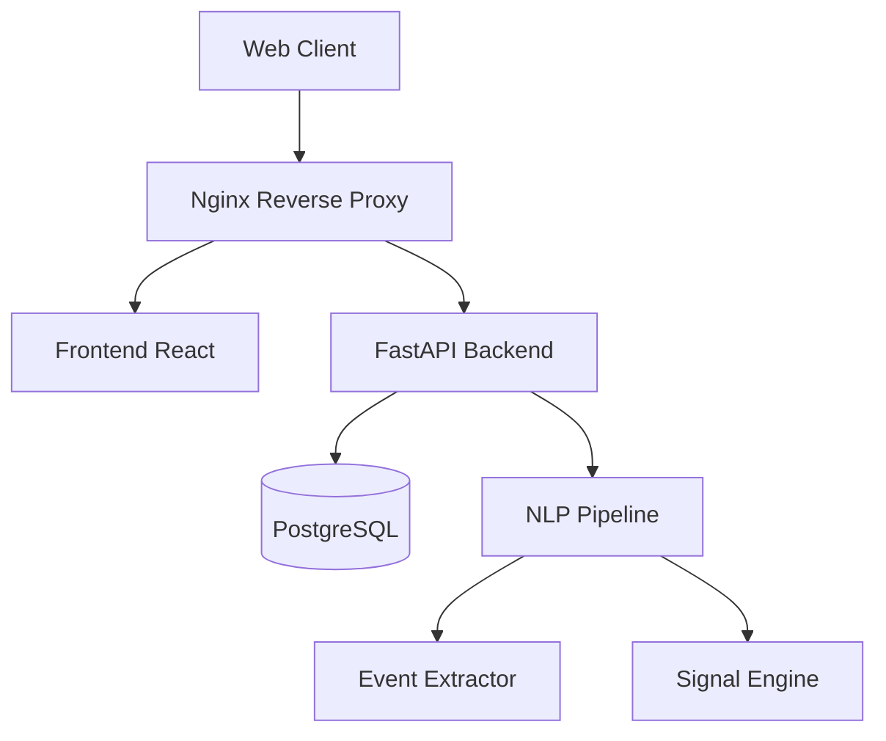

# MedGraph Architecture

## System Overview

```mermaid
graph TD
    Client[Web Client] --> Nginx[Nginx Reverse Proxy]
    Nginx --> Frontend[Frontend React]
    Nginx --> API[FastAPI Backend]
    
    API --> DB[(PostgreSQL)]
    API --> NLP[NLP Pipeline]
    
    NLP --> Extractor[Event Extractor]
    NLP --> Engine[Signal Engine]
```
